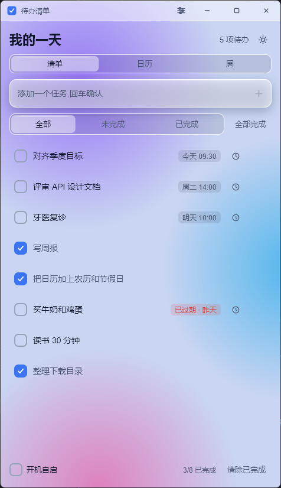
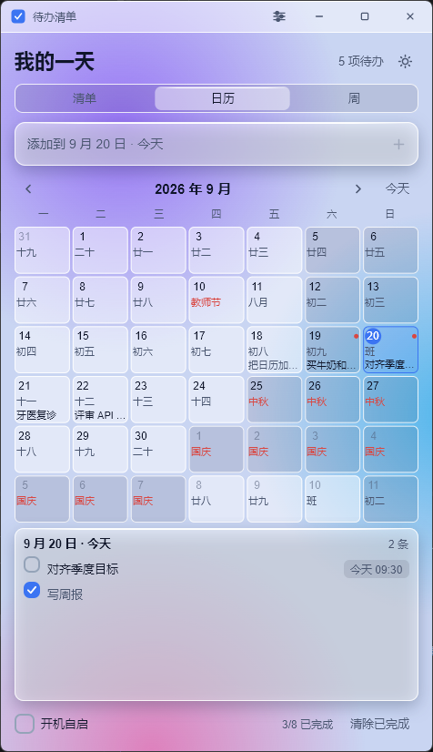
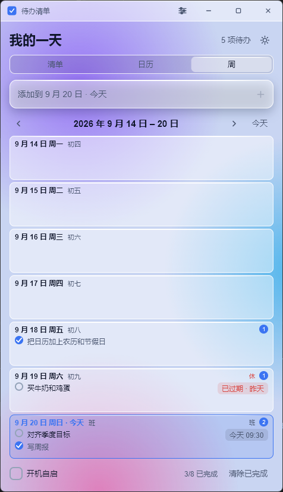
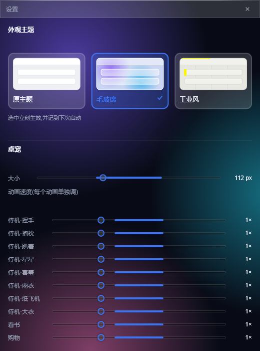
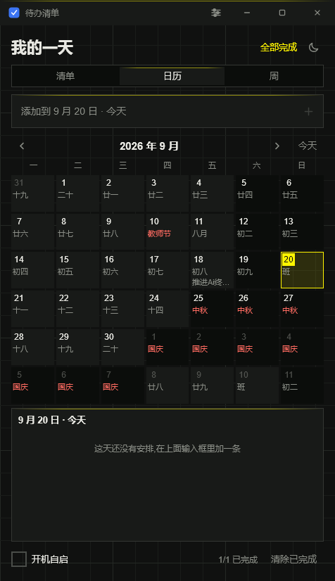

# 待办清单 · Rust + Slint

一个用 [Rust](https://www.rust-lang.org/) + [Slint](https://slint.dev/) 写的 Windows 桌面待办清单:
任务可以带时间,到点提醒,日历上能看到排期。

| 清单视图 | 月视图 | 周视图 |
|---|---|---|
|  |  |  |

## 功能

- 添加 / 勾选完成 / 删除 / 双击标题就地编辑
- **给任务设时间**:截止日期**点月历选**(能看见周末/节假日),时刻**点数字块选**
  (5 分钟一档),以及提前多久提醒(不提醒 / 准点 / 5 分钟 / 15 分钟 / 30 分钟 / 1 小时 / 1 天)。
  两个都是选择器,没有输入框,填不出非法值
- **到点弹 Windows 通知**,同时应用内把那条任务高亮,顶部出「有 N 条提醒」横幅
- **错过会补**:应用没开着时错过的提醒,下次启动合并成一条汇总,不会刷屏;超过 7 天的不再补
- **日历月视图**:6×7 网格,**带农历和节假日**;今天高亮,节日/调休标红,休息日底色压暗;
  点某天看当天任务
- **周视图**:一周 7 天竖排,每天日期 + 星期 + 农历 + 当天任务,可勾选
- **窗口可缩放**:拉大拉小内容跟着重排;窗口矮的时候日历格子自动只显示任务数量,
  把空间让给下面的任务列表
- **桌宠**:一个透明置顶的小挂件停在桌面角落 —— 可拖动、点头顶角标看未完成数、
  点一下就地记一笔、双击把主窗口叫出来、到点提醒会顶个气泡。**10 个动画全都用上了**
  (平时轮播,看书/购物/完成/提醒各有各的),大小和每个动画的速度都能在设置里单独调。
  托盘菜单可关掉它
- **托盘常驻**:关窗口只是收进托盘,进程继续跑,提醒照常;托盘菜单可打开/看今天/退出
- **开机自启**:默认关,底栏一个开关(@HKCU\...\Run,不需要管理员)
- **无边框窗口 + 自绘标题栏**:应用图标、最小化/最大化/关闭都是自己画的,风格统一;
  拖动用 Slint 的 `WindowMoveArea`(底层是系统的窗口移动),所以贴靠、拖到屏幕顶部最大化
  和原生窗口一致;双击标题栏最大化/还原
- **三种外观,随时切换**:「原主题」(不透明实心)/「毛玻璃」(半透明面板浮在彩色渐变上)/
  「工业风」(全直角 + 发丝线 + 纸墨中性色 + 信号黄)。标题栏齿轮或托盘菜单打开
  **独立的设置窗口**切换,带预览图,选择记到下次启动。只有毛玻璃用 DWM 圆角(Win11 起),
  另外两套是直角。见下面「外观」一节
- **exe 带图标**:`assets/icon.ico` 由脚本生成,构建时嵌进资源段
  (GNU 工具链用 `windres`,MSVC 用 Windows SDK 的 `rc.exe`)
- 数据自动存成 JSON,旧版本数据能直接打开(升级时自动备份)

## 运行

```sh
cargo run --release --features skia    # 推荐:文字最锐 + 桌宠能透明
cargo run                              # 不带 Skia:文字稍糊,桌宠没法透明
cargo test                             # 单元测试
```

装了 **VS Build Tools(C++ 工作负载)** 之后就走默认的 MSVC 工具链,直接 `cargo` 即可。
`run.sh` 是之前没装 MSVC 时的 GNU 工具链后备方案,现在不需要了(留着以防别的机器)。

产物在 `target/release/rgui-todo.exe`,独立的 exe,不依赖 MSVC 运行库之外的额外东西。

> **为什么双击 debug 的 exe 会多一个黑窗口**
>
> 那是控制台窗口。源码第一行 `#![cfg_attr(not(debug_assertions), windows_subsystem = "windows")]`
> 让它只在 release 构建里隐藏控制台 —— debug 留着方便看运行时报错。
> release 没有控制台,出错信息会写进 `%APPDATA%
gui-todo
gui-todo.log`。

## 外观:三种主题

标题栏齿轮(或托盘菜单的「设置」)打开一个**独立的设置窗口**切换:



三种外观跟亮暗是两个**独立维度**,一共 3×2 种组合都成立。做法是把每条调色令牌
都写成按外观分支的三元式,而 `panel-edge` / `shadow` / `blob-*` / `grid-line`
这几个装饰性令牌在「轮不到自己」的外观下直接给 `transparent` —— 这样 `PanelEdge`
和几十处 `drop-shadow-*` **不用加任何 `if`** 就自动失效了,不用在界面里到处塞条件。
(例外只有两处:日历格子的描边和标题栏的描边,原主题下要显式去掉。)

水平方向也一样:**整块界面有三十来处 `border-radius`,而 Slint 没有"全局圆角"可改**,
所以统一写成 `N px * Theme.radius-scale`,工业风把它压成 0 = 全直角。
新加圆角时记得乘上。(唯一不乘的是逾期状态那种 5px 小圆点 —— 形状本身就是圆的。)

窗口圆角也跟着外观走:只有毛玻璃要 DWM 圆角,另外两套是直角。

### 工业风(industrial)

参考[明日方舟:终末地](https://github.com/ymh0000123/dsh-theme-endfield)那套
「工业编辑风」。三条规则值得抄下来:

1. **纸与墨是主体,强调色只是信号** —— 信号黄只出现在按钮、选中态、面板顶边那 1px,
   绝不铺大面积。
2. **全直角。** 圆角会把界面推向"柔和的产品",直角才指向工程图纸。
3. **别铺施工黄。** 长文字背后的黄色底是明确的反面教材(所以 `accent-soft` 只给到
   12% 一层薄雾)。



落地时遇到一个真问题:**信号黄当填充好用,当文字没法看**。亮色(纸)模式下黄字
对比度只有 1.7:1。所以把强调色拆成了两种角色:

| 令牌 | 用途 | 暗色 | 亮色 |
|---|---|---|---|
| `accent` | **填充**:复选框、徽标、选中胶囊 | 信号黄 `#fff500` | 同左 |
| `accent-ink` | **墨迹**:文字、图标、描边、焦点框 | 信号黄 `#fff500` | 深金 `#6f6000` |

亮色下 `accent-ink` 取深金而不是退回墨黑 —— 墨黑会让"信号"和正文一个颜色,
强调色就失效了;深金对纸有 4.8:1,够读,又明显是"黄色的那一支"。
另外两套(蓝)两种角色同值,所以对它们没有任何影响。

底衬不用色斑,换成**坐标网格**(每 5 格一根主线);仍然是没有模糊原语时的同一招 ——
网格本来就是细线,不需要模糊。

### 毛玻璃是怎么做的

界面是**应用内实现**的毛玻璃:一张有色斑的底衬 + 一层层半透明的玻璃面板。
跟 web 上通行的配方一致 —— 半透明填充、1px 发丝描边、顶部高光(`PanelEdge`)、
柔和投影,四条缺一条都不像玻璃。暗色下靠描边勾勒形状,亮色下靠投影。

**为什么界面里的玻璃不透出桌面?** 因为默认的毛玻璃是**应用内实现**的 ——
底衬是程序自己画的渐变,不依赖窗口透明。这不是不能,是**默认不用**:
透明窗口那条路有代价(见下面「桌宠」一节和渲染器说明)。

> 起初这里写过一句「透明窗口在 Windows 上做不了」,**那个结论是错的**。
> 当时只试了 femtovg 和 GL 版 Skia,而真正能保留 alpha 的是**软件后端**
> (`renderer-software` / `renderer-skia-software`)—— 它的帧缓冲起始就是全透明
> (`Self(0)`),经 softbuffer 交给系统。GL 那两个的 surface 根本不申请 alpha 通道。
> 后来的桌宠就是靠这条路做的。完整排查见[设计文档 §16.1 / §22.1](docs/calendar-reminders.md)。

⚠️ **这条路的代价:窗口内容必须每处都画到。** Slint 在窗口还没映射到屏幕时就会先渲染
第一帧(X11 上防露出未初始化显存);这一帧让 softbuffer 认定「缓冲区里已经有内容了」,
于是窗口真正显示出来时,系统给的是一块全新的、**全透明的**画面,而 Slint 只补画「脏」的
那几块 —— 其余地方永远没有内容。GL 渲染器上看不出来(每帧整屏重画),但本进程为了桌宠
用的是带 alpha 的软件渲染器,那些空白就直接**透出桌面**。实测启动后主窗口只有输入框和
筛选标签两小块有内容,其余全是壁纸,几乎没法用。

修法在宿主里:每个窗口 `show()` 之后**把高度顶 1px 再收回来**(`State::reveal`)。
尺寸一变 softbuffer 就重新分配缓冲区,age 归 0,Slint 才会老老实实整窗口重画。
从外面 `request_redraw()` 没用 —— 那时 winit 窗口还没建出来,请求会被丢掉;
两次改尺寸挤在同一个 tick 里也会被合成一次、等于没改(中间留 120ms)。
细节见[设计文档 §23](docs/calendar-reminders.md)。

**没有 `backdrop-filter: blur()` 怎么办?** Slint 语言里没有任何模糊原语。
但模糊一张**已经糊的**图等于没模糊 —— 所以底衬不用照片,用**径向渐变**画的色斑:
alpha 从圆心一路衰减到半径 70% 处归零,边缘天生是软的,不需要再模糊一遍。

这里有一条最容易被跳过、也最要命的:**底下那层必须有颜色**。玻璃是半透明的,
底下透上来的颜色有多足,它就有多像玻璃。第一版把底衬做得很淡,所有面板就一起
塌成一片糊白 —— 面板一个参数没改,只是底下没颜色。

> 唯一明确牺牲玻璃感的地方是**时间设置浮层**:web 上浮层背后有 `backdrop-filter`
> 糊掉,这里没有,浮层一旦够透,底下任务的标题就会清晰地穿过浮层和自己的文字
> 叠在一起 —— 那不是毛玻璃,是「字压字」。所以浮层单独用了近乎不透明的
> `Theme.sheet`。见设计文档 §16.4。

着色(亮色主题靠投影勾勒玻璃边缘)两个渲染器都支持,文字锐度见下一节。

## 桌宠

一个透明置顶的小挂件停在桌面右下角(可拖到任意位置):

| 操作 | 行为 |
|---|---|
| 拖动 | 移动位置(宿主按指针的全局位移挪窗口,见下) |
| 单击 | 展开 / 收起快速添加输入条(宠物同时切到「看书」动画) |
| 输入 + 回车 | 加一条不带日期的任务,面板自动收起 |
| 双击 | 把主窗口叫到前台 |
| 到点提醒 | 头顶冒出气泡(「该做「xxx」了」/「有 N 条提醒」),点气泡 = 知道了 |
| 角标 | 右上角显示未完成数,0 不显示,超过 99 显示 `99+` |
| 托盘菜单 | 「显示桌宠」可勾选,选择记到下次启动 |

窗口高度会随气泡/输入条变化,但**底边钉住** —— 是从下往上长,宠物的脚不会跳。

**大小和动画速度**在设置窗口里调(边拖边生效,记到下次启动):大小 64–200px,
动画速度**每个动画一根滑杆**(0.25×–3×)。存的是 `pet_size` 和 `pet_speeds`
(动画名 → 倍率),读盘时都会夹回范围内 —— 手改 JSON 改出个 10000 不该让宠物撑满屏幕;
没配过的动画按 1.0 走,所以加素材不用动这里。

### 动画怎么播

素材一共 10 个动画(8 个待机 + 看书 + 购物),**全都用上了**:

| 时机 | 播什么 |
|---|---|
| 平时 | 8 个待机动画**轮播**:每个住够 8~15 秒就随机换一个(不连着播同一个) |
| 点开快速添加输入条 | 看书 |
| 记完一笔(回车) | 购物 |
| 勾掉一条任务 | 待机·趴着 |
| 到点提醒 | 待机·星星 |

交互那几个只播一轮就回到轮播 —— 不然「加完任务」的购物动画会一直播下去。
策略就是 `src/main.rs` 里 `PET_ANIM_LABELS` 旁边那张表,想换风格改那里。
动画名的中文说法也在这张表里(素材名保持 `idle-1` 这种,只改显示)。

> **为什么拖动没走 Slint 的 `WindowMoveArea`。** 它本来是干这个的,主窗口标题栏也一直用它,
> 但桌宠上就是拖不动:`WindowMoveArea` 靠 `input_event_filter_before_children` 拿到按下,
> 而之后的 Moved 只发给「按下时抓住鼠标的那个元素」及其**祖先** —— 宠物身上必须有个
> TouchArea 接单击/双击,按下会被它抓走,于是 WindowMoveArea 再也收不到 Moved,
> `start_window_move()` 永远不触发(对照:标题栏里没有 TouchArea,所以那边一直好使)。
> 改成宿主自己算:按下时记下指针和窗口的全局位置,拖动时 `set_position`。
> 有一条**必须**注意:窗口是跟着指针走的,所以 `mouse-x` 那类窗口内坐标在拖动过程中几乎不变,
> 算位移只能用系统指针的全局坐标。

### 素材来源与版权

⚠️ **桌宠的形象素材来自 [CorvusCinereus/Angelina](https://github.com/CorvusCinereus/Angelina)**
(一个 Qt6/C++ 写的安洁莉娜桌宠)。**角色 IP 与美术资产归鹰角网络所有** ——
源项目自己写明「图片素材加工自鹰角网络官方提供的素材」。这些素材**仅供个人使用,
不随本项目代码的许可一起授权**。

不想用它们的话:删掉 `assets/pet/` 即可,桌宠会自动不启动(日志里会记一句)。
想换成自己的:把逐帧 PNG 放进 `assets/pet/<名字>/`,在 `manifest.json` 里加一行
`{ "name": ..., "frames": ..., "delay": ... }`,**不用改任何 Rust 代码** ——
帧表是 `build.rs` 生成的。

原始素材是 1024×1024 的 GIF(共 12MB),`tools/pet-assets` 会拆帧并缩到 224×224,
输出约 3MB。之所以要转换:**Slint 的 `Image` 是静态的不会播动图**(帧得宿主自己推),
而且它默认只解 PNG/JPEG/SVG,转成 PNG 后主程序一个额外依赖都不用加。

## 关于文字清晰度

Slint 的字形栅格化**不开 hinting**,用的是灰度抗锯齿 + 亚像素定位(源码里没有任何
hinting 相关设置);Windows 原生程序走 ClearType,所以同样字号下小字会显得更"糊"。
字越小越明显,日历格子里那行农历最显眼。

实测同一块小字在两个渲染器下的锐度(相邻像素亮度差的均值,越大越锐):

| 渲染器 | 边缘强度 |
|---|---|
| femtovg | 3.46 |
| software(纯 CPU) | 4.09 |
| **skia**(GL 或软件) | **4.70** |

`--features skia` 编出来的版本会用 **`winit-skia-software`** 当默认渲染器,
不用再设 `SLINT_BACKEND`。为什么是"软件"而不是 GL 版:**桌宠要透明窗口**,
而只有软件后端的帧缓冲带 alpha 通道(原因见上一节)。它仍然走 Skia 的光栅化,
所以文字和 GL 版一样锐 —— 这是**两个都要**的唯一组合。

Skia 走的是预编译包(但从 GitHub 下载,网络不通时会退化成从源码编,那需要 LLVM),
所以它是**可选**的,默认构建不受影响(不带这个特性时用 femtovg,桌宠会是一块黑方块)。

## 代码结构

```
ui/widgets.slint   设计令牌(Theme,三种外观 × 亮暗)、与 Rust 的状态契约
                   (AppData / Logic)、小控件
                   + 底衬的积木:PanelEdge(面板顶边线)/ Blob / 网格 / Backdrop
ui/app.slint       主窗口:标题栏、视图切换、清单列表、时间设置浮层
ui/calendar.slint  日历月视图 + 选中日详情(格子按可用高度自适应详略)
ui/week.slint      周视图(一周 7 天竖排)
ui/pet.slint       桌宠窗口(独立、透明、置顶):宠物 + 未完成数角标 + 提醒气泡
                   + 点击展开的「快速添加」输入条
ui/settings.slint  设置窗口(**独立系统窗口**)+ 三张外观预览卡
                   (预览色是刻意抄的一份,不吃 Theme —— 否则选中的那套会把别的预览也改掉)
ui/icons/*.svg     图标(单色描边,用 colorize 跟着主题变色)
assets/icon.ico    exe 图标(多尺寸,由 tools/make_icon.py 生成)
assets/pet/        桌宠动画的逐帧 PNG + manifest.json(帧数/帧间隔)
                   ⚠️ 素材版权归**鹰角网络**,详见下面「桌宠」一节
tools/make_icon.py 生成图标的脚本(改设计改这里重跑,不用找美术)
tools/pet-assets/  把桌宠素材的 GIF 拆成缩放后的 PNG 帧(换素材时跑一次)
tools/screenshot.ps1 按窗口矩形精确截主窗口存 PNG(README 里那几张就是它截的);
                   也支持 -Title 截别的窗口,比如设置窗口
src/model.rs       任务数据结构、时间推导、读写盘与 v1→v2 迁移
src/calendar_info.rs 农历、节日、放假/调休(离线)
src/reminder.rs    提醒判定与通知文案(纯逻辑,可单测)
src/pet.rs         桌宠动画的加载与逐帧推进(纯逻辑,可单测)
src/platform.rs    Windows 杂活:单实例、托盘、系统通知、开机自启
src/main.rs        装配:状态、回调接线、定时器
docs/calendar-reminders.md  日历与提醒的产品设计文档 + 验收结果
```

## 架构:状态在 Rust,UI 只渲染

Slint 侧不持有任何业务数据,两边通过两个 `export global` 通信:

| | 方向 | 内容 |
|---|---|---|
| `AppData` | Rust → UI | 清单模型、日历 42 格、选中日列表、各种计数、时间编辑态 |
| `Logic` | UI → Rust | 添加、勾选、删除、编辑、切视图、翻月、设时间、确认提醒… |

> ⚠️ **全局单例不跨窗口共享。** Slint 文档原话:"Global singletons aren't shared
> between separate windows." 主窗口和设置窗口**各持有一份** `Theme` / `AppData` /
> `Logic` 实例 —— 只改主窗口那份,设置窗口纹丝不动。所以宿主侧有个
> `State::push_theme()`,凡是动主题的地方(切亮暗、切外观、开设置窗口)都走它,
> 两个窗口一起推。加新窗口时这条最容易漏。

Rust 侧用 `Vec<Todo>` 作唯一数据源,**每次变更都重建一份「按当前过滤条件筛好」的模型**
推给 UI;任务带稳定 `id`,UI 回调传的是 id 而不是下标 —— 过滤/换视图后下标会变,
用 id 就不会点错行。每次变更后落盘一次(先写 `.tmp` 再改名,避免写一半崩掉毁数据)。

时间一律按**本地时区**存成 `"YYYY-MM-DD"` / `"HH:MM"`,不存 UTC 时间戳 ——
这样时区设置或夏令时变化不会把「9:30 的会」变成 10:30(代价是不支持跨时区,一期不做)。

数据文件:`%APPDATA%\rgui-todo\todos.json`

```json
{
  "version": 2,
  "theme": "dark",
  "todos": [
    { "id": 1, "title": "对齐季度目标", "done": false,
      "due": { "date": "2026-09-18", "time": "09:30" }, "remind_before": 15 }
  ]
}
```

## 农历与节假日

农历用 `lunar-lite` 现算;法定节假日和调休用 `chinese_holiday`,内置 2004–2026 的安排,
**都离线、不联网**。格子里:初一显示月份名(「八月」「闰六月」),其余显示「初二」「廿三」;
有节日就显示节日名(红字),调休上班日显示「班」,周末和节假日的格子底色压暗一档。

> ⚠️ `chinese_holiday` 对 2004-01-01 之前或 2026-12-25 之后的日期会 **assert 直接崩**,
> 所以 `src/calendar_info.rs` 里先判范围,范围外退化成「周六周日休息」的朴素判断。
> 库升级到覆盖新年度后,把那个范围跟着改一下即可。

## 已知问题

- **系统通知在这台机器上不显示**。提醒管道本身是通的(到点触发、`notified` 落盘、
  `Toast::show()` 无报错都实测过),但通知气泡看不到 —— 连 PowerShell 自己发的 toast
  也不出现,所以是系统层面的通知抑制(专注助手/通知策略),不是代码问题。
  应用内的横幅 + 整行高亮是兜底,不会漏掉提醒。
- 通知来源名会显示成「Windows PowerShell」而不是本应用。要改成自己的名字,得在装包时
  创建带 AUMID 的开始菜单快捷方式(见设计文档 §8.2)。
- 通知点击不会跳到对应任务(同上,需要注册 COM 激活器,一期不做)。

## 只预览界面(不用编译 Rust)

`slint-viewer` 可以直接渲染 `.slint` 文件,改样式时迭代很快
(本机装在 `~/.slint-tools/slint-viewer.exe`):

```sh
slint-viewer --check ui/app.slint                     # 只做编译检查
slint-viewer --load-data ui/sample-data.json ui/app.slint   # 打开预览
```

> 注意:`--load-data` 认不出跨文件 import 的 global,拆文件后就没法用它喂数据了,
> 预览整窗口请直接跑程序。

## 用 AI 调试运行中的应用

Slint 内置了 MCP 服务器,可以列元素树、读属性、截图、模拟点击输入:

```sh
SLINT_EMIT_DEBUG_INFO=1 ./run.sh build --features slint/mcp
SLINT_MCP_PORT=9315 ./target/x86_64-pc-windows-gnu/debug/rgui-todo.exe
```

然后用 MCP 客户端连:

```
http://localhost:9315/mcp
```

界面里给关键控件起了 id,可以用 `find_elements_by_id` 按 `组件名::id` 精确定位
(`AppWindow::input`、`TodoRow::clock`、`CalendarView::goto-today` …),
方便让 AI 驱动界面做回归。

## 依赖

- `slint` 1.18(`winit` 后端 + **`winit-skia-software`** 渲染器,理由见下)
- `chrono` 日期时间、`serde` / `serde_json` 持久化
- `tray-icon` 托盘、`tauri-winrt-notification` 系统通知、`winreg` 开机自启
- `lunar-lite` 农历换算、`chinese_holiday` 法定节假日与调休(内置 2004–2026,离线)
- `windows-sys` 单实例互斥体、窗口查找、DWM(无边框窗口的圆角)
